# FlashDrop 🚀

> *Lightning-fast local network file transfers between your Mac and mobile devices*

<div align="center">


**One command. One click. Files transferred. 📱💨**

</div>

---

## ✨ What is FlashDrop?

FlashDrop is a **zero-config** file transfer server that lets you instantly send entire directories from your Mac to any device on your local network. No cables, no cloud services, no complicated setup—just pure, unadulterated file dropping magic.

### 🎯 Perfect For
- **Quick project transfers** to mobile devices
- **Photo/video sharing** without compression
- **Document syncing** during presentations
- **Code sharing** between development environments
- **Backup transfers** to phones/tablets

---

## 🚀 Quick Start

### Installation
```bash
# Clone and build
git clone https://github.com/HeySreelal/flashdrop
cd flashdrop
go build -o flashdrop flashdrop.go
```

### Usage
```bash
# Start the server
./flashdrop /path/to/your/directory

# Example
./flashdrop ~/Documents/MyProject
```

### On Your Phone
1. 📱 Open your browser
2. 🌐 Navigate to the displayed URL (e.g., `http://192.168.1.100:8000`)
3. 📦 Tap the **Download** button
4. ✅ Wait for the magic to happen!

---

## ⚡ Features That Make You Go "Wow"

<table>
<tr>
<td width="50%">

### 🎨 **Beautiful UI**
- Responsive design that looks stunning on mobile
- Smooth animations and hover effects  
- Modern gradient backgrounds
- Intuitive one-click interface

</td>
<td width="50%">

### 🧠 **The Technology**
- Auto IP detection using `ipconfig getifaddr en0`
- Intelligent zip compression
- Timestamped file naming
- Automatic cleanup of temporary files

</td>
</tr>
<tr>
<td>

### 🛡️ **Robust & Reliable**
- Comprehensive error handling
- Cross-platform zip compatibility
- Memory-efficient file streaming
- No external dependencies

</td>
<td>

### 📊 **Developer Friendly**
- Real-time transfer logging
- File size reporting
- Clean, readable Go code
- Easy to extend and customize

</td>
</tr>
</table>

---

## 🔧 Advanced Usage

### Custom Port
```bash
# Modify the port in flashdrop.go (line with ":8000")
# Then rebuild and run
```

### Multiple Directories
```bash
# Run multiple instances on different ports
./flashdrop ~/Documents &
./flashdrop ~/Pictures &  # (after modifying port)
```

### Network Discovery
```bash
# Find your Mac's IP address
ipconfig getifaddr en0

# Alternative method
ifconfig en0 | grep inet
```

---

## 🏗️ Technical Architecture

```mermaid
graph LR
    A[Mac Terminal] -->|./flashdrop ~/docs| B[Go HTTP Server]
    B -->|Auto IP Detection| C[192.168.1.x:8000]
    B -->|Serve HTML| D[Mobile Browser]
    D -->|Click Download| E[Zip Creation]
    E -->|Stream Response| F[Phone Download]
    F -->|Auto Cleanup| G[Success! 🎉]
```



### Tech Stack
- **Backend:** Pure Go with standard library
- **Frontend:** Vanilla HTML/CSS/JavaScript
- **Compression:** Go's `archive/zip` package
- **Network:** HTTP server on port 8000
- **Platform:** macOS (with easy Linux/Windows adaptation)

</div>

---

## 🤝 Contributing

We love contributions! Here's how you can help make FlashDrop even more awesome:

```bash
# 1. Fork the repository
# 2. Create a feature branch
git checkout -b feature/amazing-feature

# 3. Make your changes
# 4. Test thoroughly
go test ./...

# 5. Commit with style
git commit -m "✨ Add amazing feature that does X"

# 6. Push and create a PR
git push origin feature/amazing-feature
```

### 🎯 Ideas for Contributions
- [ ] Multi-file selection interface
- [ ] Password protection
- [ ] Upload functionality (phone → Mac)
- [ ] QR code generation for easy URL sharing
- [ ] Dark/light theme toggle
- [ ] Transfer progress bars
- [ ] Windows/Linux compatibility

---

## 🐛 Troubleshooting

<details>
<summary><strong>🔍 Server won't start</strong></summary>

```bash
# Check if port 8000 is already in use
lsof -ti:8000

# Kill any existing process
kill -9 $(lsof -ti:8000)
```
</details>

<details>
<summary><strong>📱 Can't access from phone</strong></summary>

1. Ensure both devices are on the same WiFi network
2. Check if Mac firewall is blocking connections
3. Try accessing `http://localhost:8000` on Mac first
4. Verify IP address with `ipconfig getifaddr en0`
</details>

<details>
<summary><strong>📦 Zip creation fails</strong></summary>

- Check directory permissions
- Ensure sufficient disk space for temporary files
- Verify directory path exists
</details>

---

## 📄 License

MIT License - see [LICENSE](LICENSE) file for details.

---

<div align="center">

**Made with ❤️ and ☕ for developers who love simple solutions**

[⭐ Star this repo](../../stargazers) • [🐛 Report issues](../../issues) • [💡 Request features](../../issues/new)

---

*FlashDrop: Because file transfer shouldn't be rocket science* 🚀

</div>